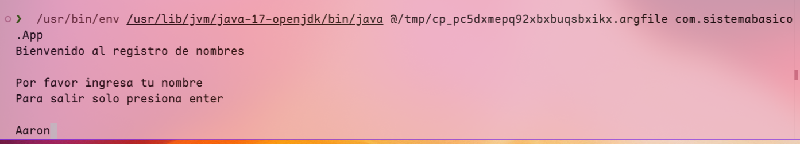

# Sistema de informacion basico
## CRUD basico
En esta tarea se hace un crud basico donde se va a ingresar un nombre a traves de terminal, el uso de ese simple programa integrador es simple, por lo que no es necesario documentar esa parte.

### Links y nombres
En el main se podran cambiar los links de base de datos y archivo si asi lo desea

### Archivo generado
Se encuentra en la propia carpeta / del repositorio local que ha de clonar

### CLASE DB
Al ingresarse, se instancia un objeto de la clase Db, el cual hace la conexion necesaria y cuenta con los metodos:
- StabilishConnection - devuelve la conexion
- InsertData - ingresa el nombre
- SelectData - obtiene toda la tabla usuario
- AmmountOfData - sin argumentos cuenta todos los registros, con el nombre como argumento cuenta todos los registros con ese nombre

### CLASE Writer
Se hace uso de una mala practica de programacion: instanciar un objeto que solo tiene su constructor xd
Recibe como argumentos un ArrayList con el contenido de la tabla sacado de Db y un String que es la ruta del archivo a crear
Solo crea el txt con el contenido de la tabla usuario

## Consideraciones

### Base de datos
La base de datos usada es mariadb server version 11.5.2-MariaDB Arch Linux; disponible en AUR actualizada
El codigo se encuentra en el archivo db.sql(./db.sql)

### JDBC
El JDBC solo fue referenciado como dependencia en el pom.xml de MAVEN, no fue necesario descargar absolutamente nada

### JDK
Este proyecto de MAVEN usa el java 17

## Test de como jala

### INGRESO 1

### SALIDA 1

### INGRESO 2 Y SALIDA 2

### ARCHIVO GENERADO

(c) ISAAC ABRAHAM DE RAMON PEREZ
SISTEMAS DE INFORMACION 1758
PROFESOR AARON VELASCO AGUSTIN
INGENIERIA EN COMPUTACION
FES ARAGON UNAM

